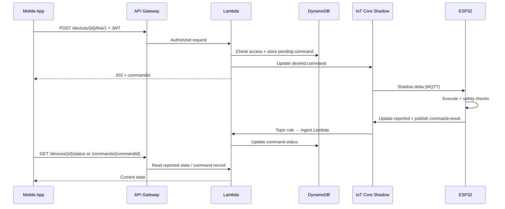

# Irrigation System Cloud Integration Implementation Plan

**Last reviewed:** 2026-05-25 (branch `iot`, merged to `main`)  
**Monorepo:** `irrigation-system/` with `irrigation-system-aws`, `irrigation-system-esp32`, `irrigation-system-mobile`

**Deploy / run:** [DEPLOYMENT.md](../DEPLOYMENT.md)

## Status (2026-05-25)

Dev **end-to-end vertical slice validated** on hardware (`irrigation-dev-001`):

- ESP32 MQTT + shadow sync (reported status/schedules)
- Mobile Cloud mode: Home, line toggles, schedules, logs
- Mobile LAN-first default with optional Cloud switch when LAN unreachable
- Lambda fixes: `LineCount` in status schema, idempotent log ingest keys

### Remaining (post-merge)

| Task | Phase |
|------|-------|
| Configure prod Cognito pool in `cdk.json` | Phase 2 / prod |
| Deploy `IrrigationApiStack-prod` | Phase 2 |
| CI/CD pipeline (GitHub Actions) | Phase 5 |
| IAM least-privilege, SNS alarms, dashboards, cert rotation runbook | Phase 5 |
| Optional: `scripts/smoke-test.ts` | Automation |

### Dev environment reference

| Item | Value |
|------|-------|
| AWS profile | `goce` |
| Region | `eu-central-1` |
| API base URL | `https://fegc56wnv1.execute-api.eu-central-1.amazonaws.com/dev` |
| IoT data endpoint | `a29kh7908vj1ca-ats.iot.eu-central-1.amazonaws.com` |
| Cognito User Pool | `eu-central-1_i66pYQHZR` |
| Cognito app client | `irrigation-system-mobile` / `5prg7oeq68ptkeqg3lc6qs50mq` |
| Test device (Thing) | `irrigation-dev-001` |
| Test user | `goce.stojcev@gmail.com` (sub `63c4f802-e0c1-7033-af34-0af61a21ef9f`, role **owner**) |
| Resource tag | `owner=irrigation-system` |

### Related docs

- [iot-implementation.md](../irrigation-system-esp32/docs/iot-implementation.md) — firmware MQTT/shadow
- [API_ENDPOINTS.md](../irrigation-system-esp32/docs/API_ENDPOINTS.md) — LAN HTTP reference
- [MOBILE_API.md](../irrigation-system-esp32/docs/MOBILE_API.md) — LAN integration guide
- [irrigation-api.v1.yaml](./openapi/irrigation-api.v1.yaml) — cloud OpenAPI
- [schemas/](./schemas/) — JSON schemas

## Objective
Enable secure remote irrigation control using AWS IoT + API Gateway + Lambda while preserving the existing mobile data shapes and keeping device-side safety authoritative.

## Validation Summary (2026-05-25)

Dev E2E validated on `irrigation-dev-001`. See [DEPLOYMENT.md](../DEPLOYMENT.md).

| Finding | Status |
|---------|--------|
| Cloud API prefix `/devices/{deviceId}/...` | **Done** |
| 3-line support (firmware + cloud + schemas) | **Done** |
| `GET /logs` DynamoDB + IoT ingest | **Done** |
| Device provisioning script | **Done** |
| ESP32 MQTT + shadow handler | **Done** (E2E verified) |
| Mobile Cloud + LAN parity | **Done** |
| Mobile LAN default + Cloud fallback | **Done** |
| Prod Cognito pool | **Not done** (`REPLACE_PROD_POOL_ID`) |

## Infrastructure as Code Standard
- All AWS infrastructure must be created and managed using AWS CDK.
- Do not provision runtime infrastructure manually in the console except for temporary troubleshooting or one-off device onboarding during development.
- Keep CDK stacks environment-aware (`dev`, `prod`) and version-controlled in this repository.

## Target Architecture
1. Mobile app calls API Gateway with Cognito JWT.
2. API Gateway Cognito authorizer validates the token.
3. Lambda validates request, checks `user → device` access in DynamoDB.
4. Lambda writes a command envelope to Thing Shadow **desired** (`state.desired.command`).
5. ESP32 MQTT client receives shadow delta, validates, executes via existing relay/scheduler logic.
6. ESP32 publishes **reported** shadow (`status`, `schedule`, `lastCommand`) and MQTT topic `irrigation/devices/{deviceId}/command-result`.
7. IoT Rule invokes ingest Lambda; `GET` routes read from Thing Shadow **reported** and/or DynamoDB (logs).



## Cloud API Scope (MVP)

All routes are under `/devices/{deviceId}` and require `Authorization: Bearer <Cognito JWT>`.

| Method | Route | Mode | Status |
|--------|-------|------|--------|
| GET | `/status` | Read shadow `reported.status` | Implemented |
| GET | `/line/{lineId}` | Read shadow | Implemented |
| POST | `/line/{lineId}` | Async command → shadow desired | Implemented |
| GET | `/schedule/{lineId}` | Read shadow | Implemented |
| POST | `/schedule/{lineId}` | Async command → shadow desired | Implemented |
| GET | `/logs` | Read DynamoDB | Implemented |
| POST | `/logs/clear` | Async command → shadow desired | Implemented |
| GET | `/commands/{commandId}` | Read DynamoDB command record | Implemented |

**MVP line scope:** lines `1`, `2`, and `3` (matches firmware `LINE_COUNT=3`).

### Logs clear policy

`POST /logs/clear` uses **cloud + device** semantics:

1. Cloud sends `logs.clear` command to the device (clears local NVS activity log).
2. Cloud immediately purges matching rows from `device_logs_{stage}` DynamoDB.
3. Mobile `GET /logs` returns empty after clear, even if the device is temporarily offline.

## Canonical Contracts

Schemas live in [schemas/](./schemas/). OpenAPI: [irrigation-api.v1.yaml](./openapi/irrigation-api.v1.yaml).

### Thing Shadow Layout

**Desired (cloud writes):**
```json
{
  "state": {
    "desired": {
      "command": {
        "schemaVersion": "1.0",
        "commandId": "uuid",
        "deviceId": "thingName",
        "type": "line.set|schedule.set|logs.clear",
        "issuedAt": "ISO-8601",
        "requestedBy": "cognito-sub",
        "payload": {}
      }
    }
  }
}
```

**Reported (device writes):**
```json
{
  "state": {
    "reported": {
      "schemaVersion": "1.0",
      "deviceId": "thingName",
      "status": {
        "Epoch": 0,
        "Time": "HH:MM:SS",
        "Line1": { "Value": "on|off", "Source": "manual|scheduled|off|system" },
        "Line2": { "Value": "on|off", "Source": "manual|scheduled|off|system" },
        "Line3": { "Value": "on|off", "Source": "manual|scheduled|off|system" }
      },
      "schedule": {
        "1": { "Enabled": true, "Start": "HH:MM:SS", "End": "HH:MM:SS", "Duration": 0, "IntervalSec": 0, "DaysMask": 0 },
        "2": { "Enabled": true, "Start": "HH:MM:SS", "End": "HH:MM:SS", "Duration": 0, "IntervalSec": 0, "DaysMask": 0 },
        "3": { "Enabled": true, "Start": "HH:MM:SS", "End": "HH:MM:SS", "Duration": 0, "IntervalSec": 0, "DaysMask": 0 }
      },
      "lastCommand": {
        "commandId": "uuid",
        "status": "pending|applied|failed|timeout",
        "updatedAt": "ISO-8601"
      }
    }
  }
}
```

Cloud `GET /status` returns the inner `status` object (same shape as local ESP32 `/status`). Other GET handlers read the matching `reported` subsection.

### Command Result (device → cloud via MQTT topic)

Topic: `irrigation/devices/{deviceId}/command-result`

```json
{
  "schemaVersion": "1.0",
  "commandId": "uuid",
  "deviceId": "thingName",
  "status": "applied|failed",
  "updatedAt": "ISO-8601",
  "appliedAt": "ISO-8601",
  "errorCode": "optional",
  "errorMessage": "optional"
}
```

Cloud assigns `commandId` on write; the mobile app never sends one. Clients poll `GET /commands/{commandId}` or re-fetch status after a write.

## Phase Plan

### Phase 1: Contract and Access Model — **Done**
| Deliverable | Status |
|-------------|--------|
| OpenAPI draft (`openapi/irrigation-api.v1.yaml`) | Done |
| JSON schemas (`schemas/*.v1.json`) | Done |
| Error code map (`docs/ERROR_CODES.md`) | Done |
| Device access model (`docs/DEVICE_ACCESS_MODEL.md`) | Done |
| DynamoDB access table design | Done (in CDK) |

**Acceptance criteria:** met for cloud-side design. Firmware sign-off pending during Phase 3 integration.

### Phase 2: Cloud MVP — **Done (dev)**
| Deliverable | Status |
|-------------|--------|
| CDK app + `IrrigationApiStack` (`dev`, `prod`) | Done |
| API Gateway + Cognito authorizer | Done |
| Lambda handlers (auth, validation, shadow R/W) | Done |
| `device_user_access_{stage}` DynamoDB table | Done |
| `device_commands_{stage}` DynamoDB table | Done |
| `device_logs_{stage}` DynamoDB table | Done |
| IoT Topic Rules → ingest Lambdas (command-result, log events) | Done |
| Command timeout sweep (EventBridge, 5 min) | Done |
| CloudWatch log groups + SNS alarms | Done |
| Stack tags (`owner=irrigation-system`) | Done |
| Seed script (`npm run seed:access`) | Done |
| Fixture runners for local handler tests | Done |
| `GET /logs` backed by DynamoDB | Done |
| Prod Cognito pool configured | Not done (`REPLACE_PROD_POOL_ID`) |
| Verified deploy + smoke test in `dev` | **Done** (E2E verified 2026-05-25) |

**Acceptance criteria:** met in dev on `irrigation-dev-001`.

### Phase 2.5: Device Onboarding — **Done (dev)**
| Deliverable | Status |
|-------------|--------|
| IoT Thing creation per device (name = `deviceId`) | Done — `irrigation-dev-001` |
| Device certificate + IoT policy | Done — `npm run provision:device` |
| Provisioning script | Done — `scripts/provision-device.ts` |
| Cognito app client for mobile | Done — `npm run setup:cognito-client` |
| `npm run seed:access` for test user + device | Done |
| Formal written runbook | Optional — script output + table above |

### Phase 3: ESP32 AWS IoT Integration — **Done (E2E verified)**
| Deliverable | Status |
|-------------|--------|
| MQTT/TLS client (PubSubClient + WiFiClientSecure) | Done |
| Shadow delta subscription on `state.command` | Done |
| Map commands to `line` / `schedule` / `logs` logic | Done (`device_api.cpp`) |
| Publish `reported` shadow + heartbeat (60s) | Done |
| Publish `command-result` to MQTT topic | Done |
| ISO-8601 timestamps from NTP epoch | Done |
| `commandId` idempotency store (NVS) | Done |
| Reconnect with backoff (Wi‑Fi + MQTT) | Done |
| WiFi via NVS / `secrets/wifi_secrets.h` | Done |
| Flash firmware + verify on hardware | Done |

**Acceptance criteria:** vertical slice works in `dev` — verified 2026-05-25. See [DEPLOYMENT.md](../DEPLOYMENT.md).

### Phase 3b: Mobile Cloud Integration — **Done**
| Deliverable | Status |
|-------------|--------|
| Cognito sign-in | Done |
| Configurable cloud base URL + device ID (Settings) | Done |
| Cloud API client with async command polling | Done |
| LAN fallback mode | Done |
| AsyncStorage persistence (IP, URL, device, mode, tokens) | Done |

### Phase 4: Logs and History — **Mostly done**
| Deliverable | Status |
|-------------|--------|
| Telemetry event schema (`Started` / `Stopped`) | Done (firmware MQTT publish) |
| IoT Rule → DynamoDB log ingestion | Done |
| `GET /logs` implementation | Done |
| `POST /logs/clear` policy (cloud + device) | Done — cloud purge + device command |

### Phase 5: Hardening and Ops — **Partial**
| Deliverable | Status |
|-------------|--------|
| Command timeout watcher | Done (Phase 2) |
| Retry / DLQ for failed shadow writes | Not started |
| IAM least-privilege review (IoT thing `*` in Lambda) | Not started |
| Certificate rotation runbook | Not started |
| Dashboards (latency, offline devices) | Not started |
| CI/CD deploy pipeline | Not started |

## Vertical Slice — **Complete (2026-05-25)**

Validated on `irrigation-dev-001`: cloud line toggles, schedules, logs, LAN-first mobile with Cloud fallback. Operational steps: [DEPLOYMENT.md](../DEPLOYMENT.md).

## Repository Tasks

### `irrigation-system-aws/`
| Task | Status |
|------|--------|
| CDK structure (`infra/`, `lambdas/`, `schemas/`, `openapi/`) | Done |
| Environment configs (`dev`, `prod` in `cdk.json`) | Done |
| Extend line validation to 3 lines | Done |
| Device provisioning script | Done |
| Cognito mobile client setup script | Done |
| Log ingest + `GET /logs` + cloud purge on `logs.clear` | Done |
| Smoke test script | **Todo** |
| CI/CD deploy pipeline | Todo |
| Prod Cognito pool + deploy | Todo |

### `irrigation-system-esp32/`
| Task | Status |
|------|--------|
| AWS IoT MQTT client module (`iot_client.cpp`) | Done |
| Shadow delta handler + command parser | Done |
| `commandId` dedupe in NVS | Done |
| Reported state + command-result publish | Done |
| Shadow heartbeat + ISO timestamps | Done |
| WiFi secrets pattern | Done |
| **Hardware E2E validation** | **Done** |

### `irrigation-system-mobile/`
| Task | Status |
|------|--------|
| Cognito auth flow | Done |
| Cloud API client + command polling | Done |
| Cloud/LAN mode + Settings (URL, device, IP) | Done |
| **E2E test on device (cloud mode)** | **Done** |

## Risks and Mitigations
- **Device offline during command:** return `202` + track `pending`; timeout sweep marks `timeout` after 120s.
- **Clock drift on device:** NTP already used in firmware; include server timestamps in command envelope.
- **Duplicate writes due to retries:** idempotency by `commandId` on device (NVS) and cloud (DynamoDB).
- **Schema drift:** versioned schemas in `irrigation-system-aws/schemas/`; firmware imports same shapes during Phase 3.
- **Line count mismatch:** resolved — cloud validates lines 1–3.

## Progress snapshot

```
Phase 1   ████████████████████  100%
Phase 2   ██████████████████░░   90%  (dev done; prod pool pending)
Phase 2.5 ████████████████████  100%  (dev device provisioned)
Phase 3   ████████████████████  100%  (E2E verified)
Phase 3b  ████████████████████  100%  (E2E verified)
Phase 4   ████████████████████  100%  (logs + clear verified)
Phase 5   ████░░░░░░░░░░░░░░░░   20%
E2E demo  ████████████████████  100%
```

## Non-Goals (initial rollout)
- Direct internet exposure of ESP32 HTTP API.
- Port forwarding / DDNS remote access.
- Replacing local LAN HTTP (may remain as optional fallback for development).
