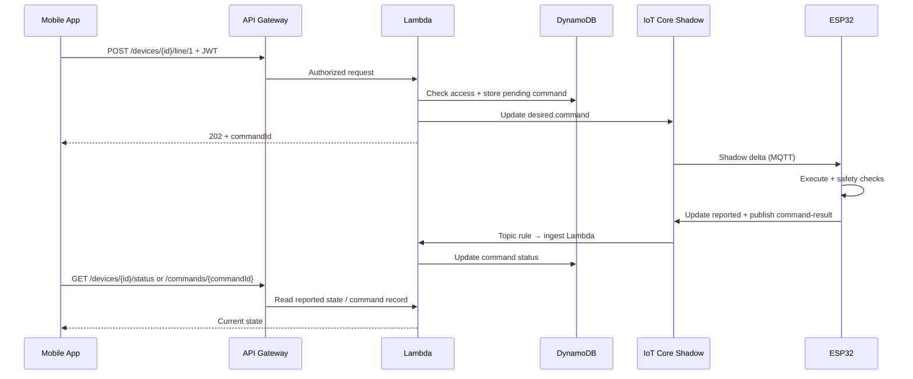

# Irrigation System Cloud Integration Implementation Plan

**Last reviewed:** 2026-05-24 (branch `iot`)  
**Monorepo:** `irrigation-system/` with `irrigation-system-aws`, `irrigation-system-esp32`, `irrigation-system-mobile`

## Source Documents
- [iot-implementation.md](../irrigation-system-esp32/docs/iot-implementation.md)
- [API_ENDPOINTS.md](../irrigation-system-esp32/API_ENDPOINTS.md)
- [API_ENDPOINTS.md](../irrigation-system-mobile/docs/API_ENDPOINTS.md)
- [irrigation-api.v1.yaml](./openapi/irrigation-api.v1.yaml)
- [schemas/](./schemas/)

## Objective
Enable secure remote irrigation control using AWS IoT + API Gateway + Lambda while preserving the existing mobile data shapes and keeping device-side safety authoritative.

## Validation Summary (2026-05-24)

The plan direction is sound. Phase 1 and most of Phase 2 cloud code are implemented. The critical path is now **Phase 3 (ESP32 MQTT)** plus mobile cloud integration — without those, the vertical slice cannot complete.

| Finding | Severity | Action |
|---------|----------|--------|
| Cloud API uses `/devices/{deviceId}/...` prefix, not bare `/line/1` | Doc drift | Documented below; OpenAPI is canonical |
| Firmware supports **3 lines** (`LINE_COUNT=3`); cloud MVP validates **lines 1–2 only** | Scope gap | Extend cloud validation before or during Phase 3 |
| `command-envelope` and handlers include `schemaVersion: "1.0"` | Doc drift | Contracts updated below |
| Phase 2 listed as future work but handlers are implemented | Status stale | Phase statuses updated |
| Timeout sweep and command-status API exist early (Phase 5 / extra scope) | Positive drift | Marked done under Phase 2 |
| `GET /logs` returns empty stub | Expected | Remains Phase 4 |
| No CDK for IoT Thing + cert provisioning | Gap | Added to Phase 2.5 |
| Plan mentions `staging`; `cdk.json` has `dev` + `prod` only | Doc drift | Staging deferred; use `dev` |
| Mobile still calls ESP32 over LAN HTTP | Blocker | Phase 3b (mobile) |
| End-to-end demo not executed | Blocker | Primary goal on `iot` branch |

## Infrastructure as Code Standard
- All AWS infrastructure must be created and managed using AWS CDK.
- Do not provision runtime infrastructure manually in the console except for temporary troubleshooting or one-off device onboarding during development.
- Keep CDK stacks environment-aware (`dev`, `prod`) and version-controlled in this repository.

## Target Architecture
1. Mobile app calls API Gateway with Cognito JWT.
2. API Gateway Cognito authorizer validates the token.
3. Lambda validates request, checks `user → device` access in DynamoDB.
4. Lambda writes a command envelope to Thing Shadow **desired** (`state.desired.command`).
5. ESP32 MQTT client receives shadow delta, validates, executes via existing relay/scheduler logic.
6. ESP32 publishes **reported** shadow (`status`, `schedule`, `lastCommand`) and MQTT topic `irrigation/devices/{deviceId}/command-result`.
7. IoT Rule invokes ingest Lambda; `GET` routes read from Thing Shadow **reported** and/or DynamoDB (logs).



## Cloud API Scope (MVP)

All routes are under `/devices/{deviceId}` and require `Authorization: Bearer <Cognito JWT>`.

| Method | Route | Mode | Status |
|--------|-------|------|--------|
| GET | `/status` | Read shadow `reported.status` | Implemented |
| GET | `/line/{lineId}` | Read shadow | Implemented |
| POST | `/line/{lineId}` | Async command → shadow desired | Implemented |
| GET | `/schedule/{lineId}` | Read shadow | Implemented |
| POST | `/schedule/{lineId}` | Async command → shadow desired | Implemented |
| GET | `/logs` | Read DynamoDB | Implemented |
| POST | `/logs/clear` | Async command → shadow desired | Implemented |
| GET | `/commands/{commandId}` | Read DynamoDB command record | Implemented |

**MVP line scope:** lines `1`, `2`, and `3` (matches firmware `LINE_COUNT=3`).

### Logs clear policy

`POST /logs/clear` uses **cloud + device** semantics:

1. Cloud sends `logs.clear` command to the device (clears local NVS activity log).
2. Cloud immediately purges matching rows from `device_logs_{stage}` DynamoDB.
3. Mobile `GET /logs` returns empty after clear, even if the device is temporarily offline.

## Canonical Contracts

Schemas live in [schemas/](./schemas/). OpenAPI: [irrigation-api.v1.yaml](./openapi/irrigation-api.v1.yaml).

### Thing Shadow Layout

**Desired (cloud writes):**
```json
{
  "state": {
    "desired": {
      "command": {
        "schemaVersion": "1.0",
        "commandId": "uuid",
        "deviceId": "thingName",
        "type": "line.set|schedule.set|logs.clear",
        "issuedAt": "ISO-8601",
        "requestedBy": "cognito-sub",
        "payload": {}
      }
    }
  }
}
```

**Reported (device writes):**
```json
{
  "state": {
    "reported": {
      "schemaVersion": "1.0",
      "deviceId": "thingName",
      "status": {
        "Epoch": 0,
        "Time": "HH:MM:SS",
        "Line1": { "Value": "on|off", "Source": "manual|scheduled|off|system" },
        "Line2": { "Value": "on|off", "Source": "manual|scheduled|off|system" },
        "Line3": { "Value": "on|off", "Source": "manual|scheduled|off|system" }
      },
      "schedule": {
        "1": { "Enabled": true, "Start": "HH:MM:SS", "End": "HH:MM:SS", "Duration": 0, "IntervalSec": 0, "DaysMask": 0 },
        "2": { "Enabled": true, "Start": "HH:MM:SS", "End": "HH:MM:SS", "Duration": 0, "IntervalSec": 0, "DaysMask": 0 },
        "3": { "Enabled": true, "Start": "HH:MM:SS", "End": "HH:MM:SS", "Duration": 0, "IntervalSec": 0, "DaysMask": 0 }
      },
      "lastCommand": {
        "commandId": "uuid",
        "status": "pending|applied|failed|timeout",
        "updatedAt": "ISO-8601"
      }
    }
  }
}
```

Cloud `GET /status` returns the inner `status` object (same shape as local ESP32 `/status`). Other GET handlers read the matching `reported` subsection.

### Command Result (device → cloud via MQTT topic)

Topic: `irrigation/devices/{deviceId}/command-result`

```json
{
  "schemaVersion": "1.0",
  "commandId": "uuid",
  "deviceId": "thingName",
  "status": "applied|failed",
  "updatedAt": "ISO-8601",
  "appliedAt": "ISO-8601",
  "errorCode": "optional",
  "errorMessage": "optional"
}
```

Cloud assigns `commandId` on write; the mobile app never sends one. Clients poll `GET /commands/{commandId}` or re-fetch status after a write.

## Phase Plan

### Phase 1: Contract and Access Model — **Done**
| Deliverable | Status |
|-------------|--------|
| OpenAPI draft (`openapi/irrigation-api.v1.yaml`) | Done |
| JSON schemas (`schemas/*.v1.json`) | Done |
| Error code map (`docs/ERROR_CODES.md`) | Done |
| Device access model (`docs/DEVICE_ACCESS_MODEL.md`) | Done |
| DynamoDB access table design | Done (in CDK) |

**Acceptance criteria:** met for cloud-side design. Firmware sign-off pending during Phase 3 integration.

### Phase 2: Cloud MVP — **Mostly done**
| Deliverable | Status |
|-------------|--------|
| CDK app + `IrrigationApiStack` (`dev`, `prod`) | Done |
| API Gateway + Cognito authorizer | Done |
| Lambda handlers (auth, validation, shadow R/W) | Done |
| `device_user_access_{stage}` DynamoDB table | Done |
| `device_commands_{stage}` DynamoDB table | Done |
| IoT Topic Rule → ingest Lambda | Done |
| Command timeout sweep (EventBridge, 5 min) | Done (early) |
| CloudWatch log groups + SNS alarms | Done |
| Seed script (`npm run seed:access`) | Done |
| Fixture runners for local handler tests | Done |
| `GET /logs` backed by DynamoDB | Not started (Phase 4) |
| Prod Cognito pool configured | Not done (`REPLACE_PROD_POOL_ID`) |
| Verified deploy + smoke test in `dev` | Not confirmed in repo |

**Acceptance criteria:** code paths exist for 202/4xx/auth; needs live `dev` deployment test with a registered IoT Thing.

### Phase 2.5: Device Onboarding (new) — **Not started**
Required before end-to-end demo.

| Deliverable | Status |
|-------------|--------|
| IoT Thing creation per device (name = `deviceId`) | Manual / script TBD |
| Device certificate + IoT policy (connect, shadow, publish command-result) | Manual / script TBD |
| Provisioning runbook or CDK/custom resource | Not started |
| `npm run seed:access` run for test user + device | Documented, not executed in repo |

### Phase 3: ESP32 AWS IoT Integration — **Not started** (active work on `iot` branch)
| Deliverable | Status |
|-------------|--------|
| MQTT/TLS client (Arduino + AWS IoT SDK or equivalent) | Not started |
| Shadow delta subscription on `state.desired.command` | Not started |
| Map commands to existing `line` / `schedule` / `logs` logic | Not started |
| Publish `reported` shadow (`status`, `schedule`, `lastCommand`) | Not started |
| Publish `command-result` to MQTT topic | Not started |
| `commandId` idempotency store (NVS) | Not started |
| Reconnect with backoff (Wi‑Fi + MQTT) | Not started |

**Acceptance criteria:** vertical slice works in `dev` — see below.

### Phase 3b: Mobile Cloud Integration — **Not started**
| Deliverable | Status |
|-------------|--------|
| Cognito sign-in (hosted UI or app-native) | Not started |
| Configurable cloud base URL + device selector | Not started |
| Replace direct `http://<esp32-ip>` calls | Not started |
| Async write UX (pending → poll command/status) | Not started |
| Optional LAN fallback to local ESP32 HTTP | Not decided |

### Phase 4: Logs and History — **Mostly done**
| Deliverable | Status |
|-------------|--------|
| Telemetry event schema (`Started` / `Stopped`) | Done (firmware MQTT publish) |
| IoT Rule → DynamoDB log ingestion | Done |
| `GET /logs` implementation | Done |
| `POST /logs/clear` policy (cloud + device) | Done — cloud purge + device command |

### Phase 5: Hardening and Ops — **Partial**
| Deliverable | Status |
|-------------|--------|
| Command timeout watcher | Done (Phase 2) |
| Retry / DLQ for failed shadow writes | Not started |
| IAM least-privilege review (IoT thing `*` in Lambda) | Not started |
| Certificate rotation runbook | Not started |
| Dashboards (latency, offline devices) | Not started |
| CI/CD deploy pipeline | Not started |

## Vertical Slice (current priority)

Implement and demo this path in `dev` before expanding scope:

1. Register one IoT Thing + flash firmware with cert (Phase 2.5).
2. Seed `device_user_access_dev` for a Cognito test user (Phase 2.5).
3. `POST /devices/{deviceId}/line/1` → `202` + `commandId`.
4. ESP32 receives shadow delta, turns line 1 on, publishes result.
5. `GET /devices/{deviceId}/commands/{commandId}` → `applied`.
6. `GET /devices/{deviceId}/status` → `Line1.Value == "on"`.

**Success metrics:**
- P50 command latency < 2s
- P95 command latency < 5s
- 0 duplicate execution for retried requests (same `commandId`)

## Repository Tasks

### `irrigation-system-aws/`
| Task | Status |
|------|--------|
| CDK structure (`infra/`, `lambdas/`, `schemas/`, `openapi/`) | Done |
| Environment configs (`dev`, `prod` in `cdk.json`) | Done |
| Extend line validation to 3 lines (match firmware) | Todo |
| Device provisioning script / CDK | Todo |
| CI/CD deploy pipeline | Todo |

### `irrigation-system-esp32/`
| Task | Status |
|------|--------|
| AWS IoT MQTT client module | Todo |
| Shadow delta handler + command parser | Todo |
| `commandId` dedupe in NVS | Todo |
| Reported state + command-result publish | Todo |

### `irrigation-system-mobile/`
| Task | Status |
|------|--------|
| Cognito auth flow | Todo |
| Cloud API client (replace axios → ESP32 IP) | Todo |
| Command pending / polling UX | Todo |

## Risks and Mitigations
- **Device offline during command:** return `202` + track `pending`; timeout sweep marks `timeout` after 120s.
- **Clock drift on device:** NTP already used in firmware; include server timestamps in command envelope.
- **Duplicate writes due to retries:** idempotency by `commandId` on device (NVS) and cloud (DynamoDB).
- **Schema drift:** versioned schemas in `irrigation-system-aws/schemas/`; firmware imports same shapes during Phase 3.
- **Line count mismatch:** extend cloud to 3 lines before user-facing rollout.

## Next Actions (`iot` branch)
1. Add ESP32 MQTT/TLS connect + shadow delta subscription scaffold.
2. Implement command parser for `line.set` mapped to existing relay control.
3. Publish `command-result` and update `reported.status` + `lastCommand`.
4. Create device provisioning runbook (Thing, cert, policy, seed access).
5. Deploy `dev` stack and run vertical slice smoke test.
6. Extend cloud line validation from 2 → 3 lines to match firmware.

## Non-Goals (initial rollout)
- Direct internet exposure of ESP32 HTTP API.
- Port forwarding / DDNS remote access.
- Replacing local LAN HTTP (may remain as optional fallback for development).
